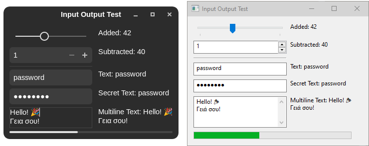

# libui [![Crates.io][crates-badge]][crates-url] [![Build Status][build-badge]][build-url] [![License: MIT][mit-badge]][mit-url] [![License: Apache][apc-badge]][apc-url]

[crates-badge]: https://img.shields.io/crates/v/libui.svg
[crates-url]: https://crates.io/crates/libui
[build-badge]: https://github.com/libui-rs/libui/actions/workflows/ci.yml/badge.svg?branch=master
[build-url]: https://github.com/libui-rs/libui/actions?query=workflow%3ACI+branch%3Amaster
[mit-badge]: https://img.shields.io/badge/License-MIT-brightgreen.svg
[mit-url]:https://opensource.org/licenses/MIT
[apc-badge]: https://img.shields.io/badge/License-Apache%202.0-blue.svg
[apc-url]:https://opensource.org/licenses/Apache-2.0

## The native cross-platform UI toolkit for Rust

`libui` is a **simple**, **small** and **easy to distribute** GUI library. It provides a native UI for your platform by utilising your systems API instead of implementing yet another mismatched looking renderer. Thus all `libui` apps are lightweight, have a native look and feel and start from a highly performant base which is well integrated with the ecosystem on each platform. Because it implements only the common subset of these platform APIs, your apps will work on all platforms and won't have significant behavioral inconsistencies, with no additional effort on your part. If you only plan to support one platform however, a specialized crate will
provide a better experience.

Technically, `libui` is a "rustification" wrapper over the C library [`libui-ng`](https://github.com/libui-ng/libui-ng), which actually abstracts the native GUI framework. That is the Win32 API on Windows, Cocoa on Mac OS X, and GTK3 for Linux and others.

## Example

Add `libui` to your dependency list in `cargo.toml` with:

```toml
libui = "0.1.0"
```

or use the latest version from the repository:

```toml
libui = { git = "https://github.com/libui-rs/libui" }
```

Next we suggest to have a look at the [example applications](https://github.com/libui-rs/libui/tree/development/libui/examples) or start with the minimal example printed here:

```rust
#![cfg_attr(not(test), windows_subsystem = "windows")]
#![cfg_attr(test, windows_subsystem = "console")]

extern crate libui;
use libui::controls::*;
use libui::prelude::*;

fn main() {
    let ui = UI::init()
        .expect("Couldn't initialize UI library");
    
    let mut win = Window::new(&ui, "Example", 300, 200, 
        WindowType::NoMenubar);
    let layout = VerticalBox::new();

    // add controls to your layout here

    win.set_child(layout);
    win.show();
    ui.main();
}
```

We also have documentation on [docs.rs](https://docs.rs/libui) for all released versions.

## Screenshots

On the left see a `libui` application running on a GNOME desktop with GTK 3. On the right under Windows 10 with its native user interface.



For more screenshots, see [`here`](https://github.com/libui-rs/libui/tree/development/images).

## Compatibility

`libui` was successfully tested on:
* Windows 7 SP1
* Windows 10 22H2
* Debian 12 w/ GNOME 43 & GTK 3.24
* macOS Big Sur 11.6

## Prerequisits & Building

To build the underlying `libui-ng` your system must have certain tools installed in addition to your rust toolchain. I am trying to cut down on the inconveniences as far as possible.

__Linux:__
* libgtk-3-dev (debian package) - for compiling `libui-ng`
* libclang (debian package) - for generating the `libui-ng` bindings

__Windows:__
* MSVC (via Windows SDK or Visual Studio)
* LLVM - for generating the `libui-ng` bindings

Note: MinGW-64 does compile and link, but the application won't start due to MinGW missing `TaskDialog()`. Reportedly, with versions >= 5.X, the function is available.

## Acknowledgments

| Entity                                                                          | Acknowledgement                                                    | Further Information                                                   |
|---------------------------------------------------------------------------------|--------------------------------------------------------------------|-----------------------------------------------------------------------|
| [@pcwalton](https://github.com/pcwalton/)                                       | Initial author. Largely shaped this library.                       | [pcwalton/libui-rs](https://github.com/pcwalton/libui-rs)             |
| [@NoraCodes](https://github.com/NoraCodes/) and others                          | Further development and maintenance.                               | [rust-native-ui/libui-rs](https://github.com/rust-native-ui/libui-rs) |
| [@tobia](https://github.com/tobia)                                              | `libui::layout!` macro for easier UI description.                   | [tobia/iui-builder](https://github.com/tobia/iui-builder)             |
| [@andlabs](https://github.com/andlabs)                                          | Author of the C library `libui`.                                   | [andlabs/libui](https://github.com/andlabs/libui)                     |
| [@szanni](https://github.com/szanni) and [@cody271](https://github.com/cody271) | Maintainers of `libui-ng`. The underlying library to this wrapper. | [libui-ng/libui-ng](https://github.com/libui-ng/libui-ng)             |